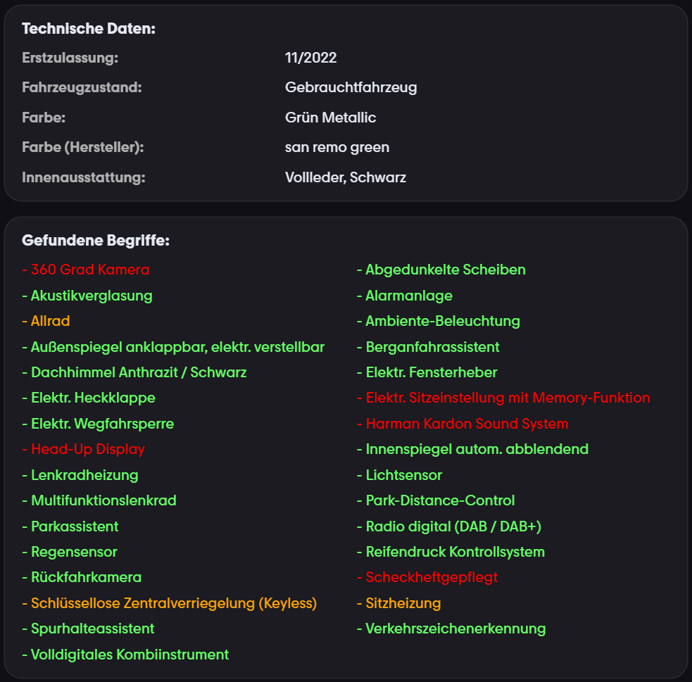
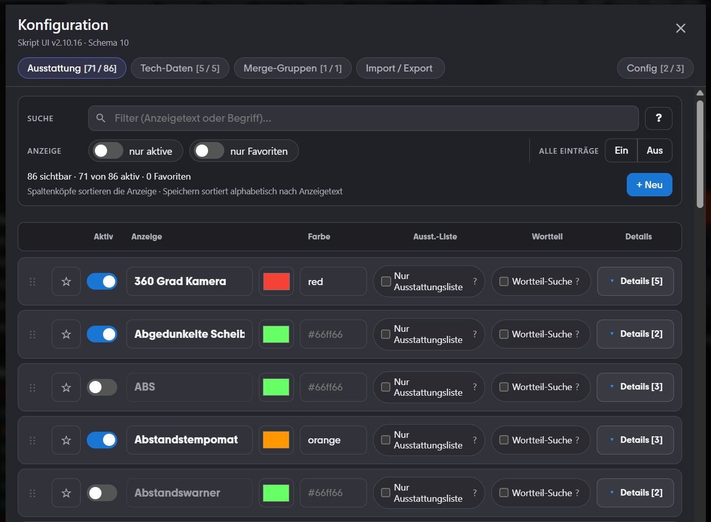
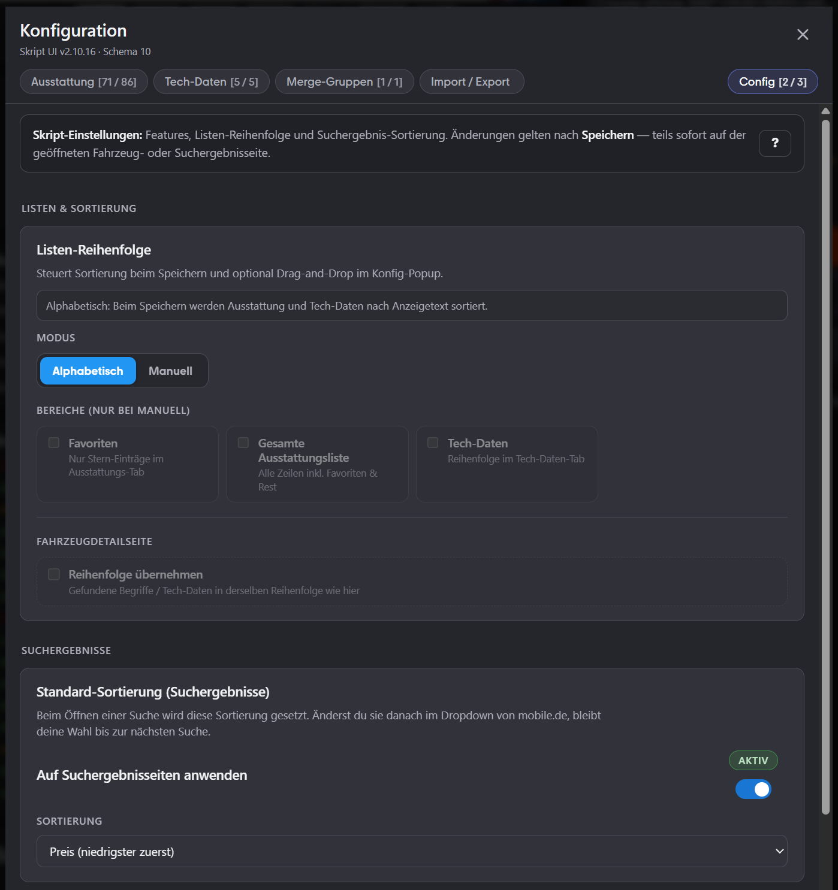

# Mobile.de Ausstattungssuche mit Popup & Import/Export

Tampermonkey-Skript für **mobile.de**-Fahrzeugdetailseiten: definierte **Ausstattungsbegriffe** und ausgewählte **Technische Daten** werden automatisch aus der Seite gewonnen, farbig dargestellt und über ein **Konfigurations-Popup** verwaltbar. Konfigurationen lassen sich per **Import/Export (JSON)** sichern oder teilen.

## Funktionen

- Token-basierte Suche mit Wortgrenzen, optional **„Nur Ausstattungsliste“** und **„Wortteil-Suche“**.
- Kombination angezeigter Treffer („Merge-Gruppen“, z.&nbsp;B. Außenspiegel-Zusammenfassung).
- Zusätzliche **Tech-Daten**-Zeilen im Ergebnisbereich.
- **SPA-tauglich** (Observer + gedrosseltes Nachladen nach DOM-/URL-Wechsel).
- Unter **Konfiguration → Config**: z.&nbsp;B. **Standort als Google-Maps-Link** (PLZ/Stadt klickbar), optional **Automodus**, **Listen-Reihenfolge** (alphabetisch oder manuell per Drag&nbsp;&amp;&nbsp;Drop, Bereiche wählbar) und **Standard-Sortierung** für die PKW-Suchergebnisseite (z.&nbsp;B. Preis aufsteigend; manuelle Änderung im Dropdown bleibt bis zur nächsten Suche erhalten).
- **Automodus** (Config-Tab, standardmäßig aus): Zeigt alle Einträge aus der Ausstattungsliste und strukturierter Komma-Beschreibung in einer Liste. Treffer aus deiner Ausstattungs-Konfiguration werden **farbig** hervorgehoben; übrige Zeilen erscheinen grau. Per **+ Konfig** lässt sich ein unbekannter Eintrag im Popup vorausgefüllt anlegen. Ausgeschaltet verhält sich das Skript wie bisher (nur konfigurierte Suchbegriffe).
- Popup mit Filter, Bulk-Aktionen, Drag-and-Drop (sichtbare Zeilen-Vorschau), konfigurierbarer Listen-Reihenfolge, Undo, Hilfe-Tabs und Validierungshinweisen.

## Installation

1. [Tampermonkey](https://www.tampermonkey.net/) (oder kompatibles Userscript-Manager-Add-on) installieren.
2. Skriptdatei [`mobile-ausstattungssuche.js`](https://raw.githubusercontent.com/jxnxtxan/Mobile/main/mobile-ausstattungssuche.js) in Tampermonkey öffnen bzw. per „Neues Userscript aus URL …“ einbinden (`@updateURL` / `@downloadURL` zeigen darauf).

## Entwicklung (Build)

Quellcode liegt unter `src/`. Einstieg ist `src/main.js` → `src/app.js` (Verdrahtung).
Aufteilung:

| Verzeichnis | Inhalt |
| --- | --- |
| `src/config/` | Defaults, Persistenz, Feature-Flags, Migration, Laufzeit-State |
| `src/core/` | Match-Engine, DOM-Selektoren, Suchpipeline, Automodus, Merge-Gruppen |
| `src/lifecycle/` | Observer, Scheduler, URL-Wechsel, inkrementelle SRP-/Maps-Refreshes |
| `src/features/` | Preisbewertung (VIP + SRP), SRP-Sortierung, Debug-Karten |
| `src/ui/results/` | Ergebnis- und Tech-Rendering samt Render-Cache |
| `src/popup/` | Konfigurations-Popup |

Die installierbare Datei `mobile-ausstattungssuche.js` im Repo-Root wird per Build erzeugt:

```bash
npm install
npm run build
```

- `npm run lint` prüft mit ESLint; `no-undef` ist scharf geschaltet und läuft auch
  als Gate vor jedem `npm run build`. Beim Herauslösen der Module aus dem früheren
  Monolithen sind mehrfach Bezeichner ohne Import stehengeblieben — das Bundle läuft
  in `'use strict'`, solche Stellen werfen erst zur Laufzeit.

- **Version** in `vite.config.js` (`USERSCRIPT_VERSION`) und `package.json` pflegen.
- `npm run dev` startet den Vite-Dev-Server von vite-plugin-monkey (Tampermonkey-Test mit lokalem Build).
- Ausgabe: `dist/mobile-ausstattungssuche.user.js` → wird nach `mobile-ausstattungssuche.js` kopiert.

## Screenshots

### Ergebnis auf der Detailseite

Über dem Aktionsbereich erscheinen der Block **„Technische Daten:“** und **„Gefundene Begriffe:“** bzw. im Automodus **„Ausstattung (vollständig):“** mit farblicher Zuordnung (z.&nbsp;B. Ampel-/Prioritätsfarben wie im Skript eingestellt).



### Aktionsbereich mit Konfigurations-Button

Der Button **Konfiguration** sitzt zusammen mit „E-Mail schreiben“, „Geparkt“ und „Teilen“ im typischen Aktionsbereich auf der rechten Spalte.


### Popup: Ausstattung & weitere Tabs

Filter, Schalter für jeden Eintrag, Farbwahl (Hex oder Schlüsselwort), Optionen „Nur Ausstattungsliste“ / „Wortteil-Suche“, aufklappbare **Details** (Suchbegriffe, Verbotene), sowie Tabs für Tech-Daten, Merge-Gruppen, Import/Export und einen Config-Tab.



### Popup: Config (Listen & Suchergebnis-Sortierung)

Im Tab **Config** werden Skript-Optionen zentral gesteuert, z.&nbsp;B. **Listen-Reihenfolge** (alphabetisch/manuell, optionale Bereiche) und die **Standard-Sortierung** auf Suchergebnisseiten inkl. Schalter „Auf Suchergebnisseiten anwenden“.



## Suchkriterien anpassen

1. Auf der Detailseite **Konfiguration** öffnen.
2. Unter **Ausstattung** Begriffe, Anzeigetext und Optionen pflegen oder **Tech-Daten**, **Merge-Gruppen** und **Import/Export** nutzen.
3. Mit **Speichern** dauerhaft in Tampermonkey-Speicher schreiben; **Abbrechen** verwirft Änderungen im aktuellen Dialog.

## Import / Export

- **Export:** Im Popup **Export aktualisieren** – JSON ablegen oder kopieren.
- **Import:** JSON ins Feld einfügen und **Import durchführen** bestätigen.
