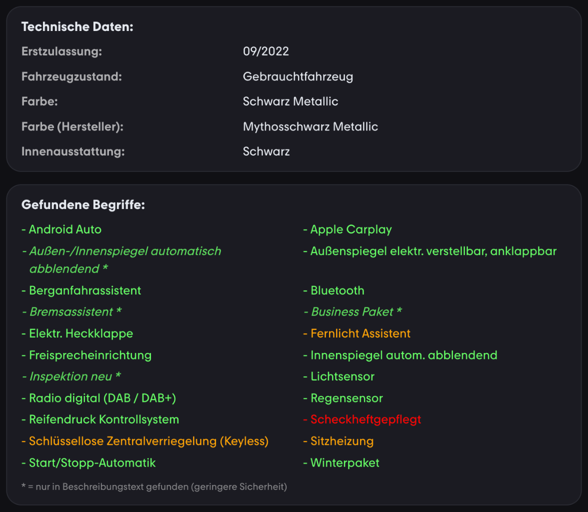
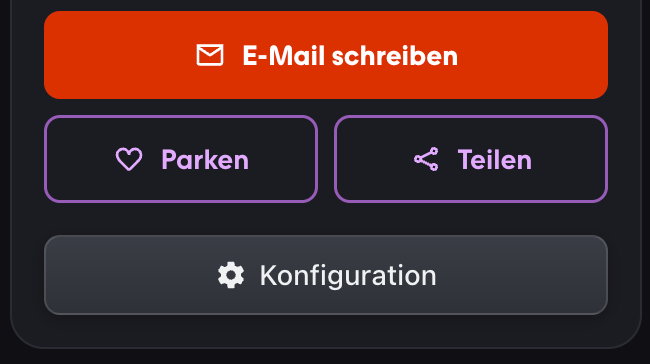
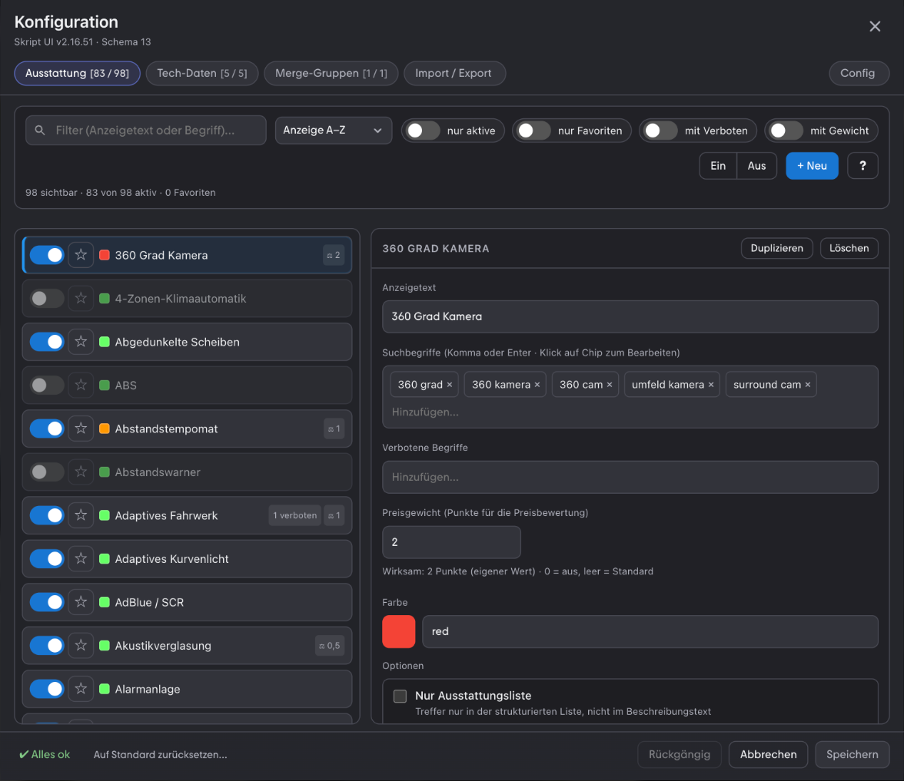
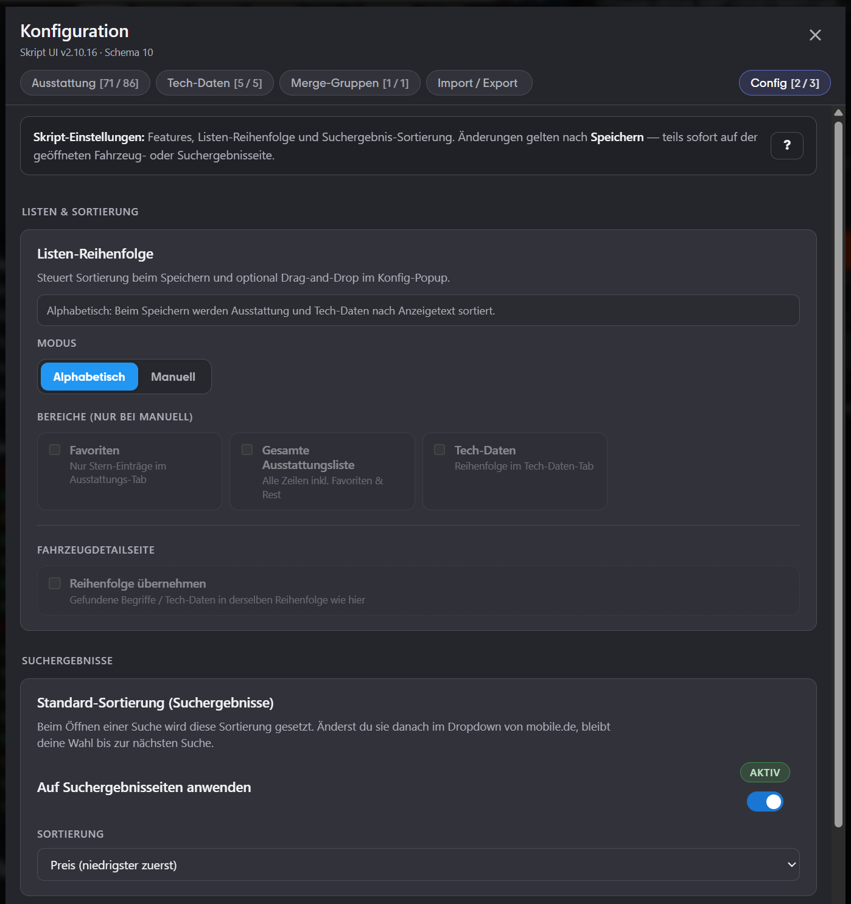

# mobile.de Ausstattungssuche & Preisbewertung (Tampermonkey-Userscript)

[](https://github.com/jxnxtxan/Mobile.de/releases/latest)
[](LICENSE)
[](https://www.tampermonkey.net/)
[](https://violentmonkey.github.io/)

**Gebrauchtwagen auf mobile.de schneller bewerten:** Das kostenlose Userscript hebt auf jeder Fahrzeugseite die Ausstattung hervor, die dir wichtig ist (z.&nbsp;B. Anhängerkupplung, Standheizung, Head-up-Display, Matrix-LED), zeigt ausgewählte technische Daten kompakt an und bewertet den **Preis ausstattungsbereinigt** im Vergleich zu ähnlichen Inseraten — direkt auf der Detailseite und in der Suchergebnisliste.

<p align="center">
  <a href="https://github.com/jxnxtxan/Mobile.de/releases/latest/download/mobile-ausstattungssuche.user.js"><b>⬇️ Jetzt installieren</b></a>
  &nbsp;·&nbsp;
  <a href="https://jxnxtxan.github.io/Mobile.de/">Projektseite</a>
  &nbsp;·&nbsp;
  <a href="https://github.com/jxnxtxan/Mobile.de/releases">Änderungen</a>
  &nbsp;·&nbsp;
  <a href="https://github.com/jxnxtxan/Mobile.de/issues">Fehler melden</a>
</p>



> 🇬🇧 **English:** A free userscript for [mobile.de](https://www.mobile.de), Germany's largest used-car marketplace. It highlights the equipment you care about on every listing, shows key technical data at a glance and rates the asking price against comparable cars, adjusted for equipment differences. Works with Tampermonkey and Violentmonkey in Chrome, Firefox, Edge and Safari.

> Kein offizielles Produkt von mobile.de. „mobile.de“ ist eine Marke der mobile.de GmbH; dieses Projekt steht in keiner Verbindung zu ihr.

## Installation

1. Einen Userscript-Manager installieren: [Tampermonkey](https://www.tampermonkey.net/) (Chrome, Firefox, Edge, Safari) oder [Violentmonkey](https://violentmonkey.github.io/).
2. **[mobile-ausstattungssuche.user.js installieren](https://github.com/jxnxtxan/Mobile.de/releases/latest/download/mobile-ausstattungssuche.user.js)** — der Userscript-Manager öffnet den Installationsdialog.
3. Eine Fahrzeugseite auf [suchen.mobile.de](https://suchen.mobile.de) öffnen. Über den Button **Konfiguration** im Aktionsbereich passt du Begriffe, Farben und die Preisbewertung an.

Updates kommen automatisch über den Userscript-Manager. Chrome: Für Tampermonkey muss unter Umständen in den Erweiterungs-Details „Nutzerskripts zulassen“ aktiviert sein.

## Funktionen

- **Ausstattung hervorheben:** Token-basierte Suche mit Wortgrenzen, optional **„Nur Ausstattungsliste“** und **„Wortteil-Suche“**, eigene Farben und Favoriten.
- **Merge-Gruppen:** Zusammengehörige Treffer werden zu einer Zeile zusammengefasst (z.&nbsp;B. „Außenspiegel elektr. verstellbar, beheizbar, anklappbar“).
- **Technische Daten** als kompakte Zeilen im Ergebnisbereich.
- **Preisbewertung** (siehe [eigener Abschnitt](#preisbewertung)): ausstattungsbereinigte Einordnung des Preises auf Detailseite und Suchergebnisliste.
- **Automodus** (Config-Tab, standardmäßig aus): Zeigt alle Einträge aus der Ausstattungsliste und strukturierter Komma-Beschreibung in einer Liste. Treffer aus deiner Ausstattungs-Konfiguration werden **farbig** hervorgehoben; übrige Zeilen erscheinen grau. Per **+ Konfig** lässt sich ein unbekannter Eintrag im Popup vorausgefüllt anlegen.
- **Komfort:** Standort als **Google-Maps-Link**, **Listen-Reihenfolge** (alphabetisch oder manuell per Drag&nbsp;&amp;&nbsp;Drop) und **Standard-Sortierung** für die Suchergebnisseite (z.&nbsp;B. Preis aufsteigend).
- **SPA-tauglich** (Observer + gedrosseltes Nachladen nach DOM-/URL-Wechsel).
- **Konfigurations-Popup** mit Filter, Bulk-Aktionen, Drag-and-Drop, Undo, Hilfe-Tabs, Validierungshinweisen und **Import/Export (JSON)** zum Sichern und Teilen.

## Preisbewertung

Auf der Fahrzeugdetailseite (neben dem Preis) und in der Suchergebnisliste zeigt das Skript eine **ausstattungsbereinigte Preisbewertung** als Balkenanzeige mit Label.

- **Vergleichsbasis (Kohorte):** ähnliche Fahrzeuge (Marke/Modell, optional Baureihe, Kilometerstand, Erstzulassung und Leistung innerhalb konfigurierbarer Toleranzen). Die Daten stammen aus besuchten Suchergebnisseiten; ohne ausreichend Vergleichsfahrzeuge erscheint „zu wenig Vergleichsdaten“ bzw. ein Hinweis, die Vergleichssuche manuell zu öffnen (ⓘ).
- **Ausstattungsbereinigung:** Unterschiede in der Ausstattung werden anhand deiner Ausstattungs-Konfiguration (Gewichte, optional nur Favoriten) in den Vergleichspreis eingerechnet; die maximale Korrektur ist begrenzt.
- **Fallback:** Ohne Kohorte kann der native mobile.de-Marktpreis herangezogen werden.
- **Stufen:** Sehr guter, Guter, Fairer, Erhöhter und Hoher Preis (Schwellen im Popup anpassbar).
- **Caching:** Die fertige Bewertung wird kurz im `localStorage` (ca. 3&nbsp;Minuten, tabübergreifend) und im `sessionStorage` gehalten; Kohorten- und Ausstattungsdaten bleiben ca. 20&nbsp;Minuten im `localStorage`. Nach einem Browser-Neustart wird die Bewertung daher in der Regel neu berechnet.
- **Konfiguration und Debug:** Schwellen, Toleranzen, €/Punkt, Mindestanzahl Vergleiche, Cache-Schritte sowie Debug-Karten/Log sind im Popup einstellbar; Änderungen mit starker Auswirkung fragen vorher nach.

## Entwicklung (Build)

Quellcode liegt unter `src/`. Einstieg ist `src/main.js` → `src/app.js` (Verdrahtung).
Aufteilung:

| Verzeichnis | Inhalt |
| --- | --- |
| `src/config/` | Defaults, Persistenz, Feature-Flags, Migration, Laufzeit-State |
| `src/core/` | Match-Engine, DOM-Selektoren, Suchpipeline, Automodus, Merge-Gruppen |
| `src/lifecycle/` | Observer, Scheduler, URL-Wechsel, inkrementelle SRP-/Maps-Refreshes |
| `src/features/` | Preisbewertung (VIP + SRP), SRP-Sortierung, Debug-Karten |
| `src/ui/results/` | Ergebnis- und Tech-Rendering samt Render-Cache |
| `src/popup/` | Konfigurations-Popup |

Die installierbare Datei `mobile-ausstattungssuche.js` im Repo-Root wird per Build erzeugt:

```bash
npm install
npm run build
```

- `npm test` führt die Node-Tests in `test/` aus (`node --test`): Parsing-, Match-Engine- und Preisbewertungslogik ohne DOM (kein jsdom). `npm run build` läuft nur durch, wenn **Lint und Tests** grün sind (`lint && test && vite build`).
- `npm run lint` prüft mit ESLint; `no-undef` ist scharf geschaltet und läuft auch
  als Gate vor jedem `npm run build`. Beim Herauslösen der Module aus dem früheren
  Monolithen sind mehrfach Bezeichner ohne Import stehengeblieben — das Bundle läuft
  in `'use strict'`, solche Stellen werfen erst zur Laufzeit.

- **Version** in `vite.config.js` (`USERSCRIPT_VERSION`) und `package.json` pflegen.
- `npm run dev` startet den Vite-Dev-Server von vite-plugin-monkey (Tampermonkey-Test mit lokalem Build).
- Ausgabe: `dist/mobile-ausstattungssuche.user.js` → wird nach `mobile-ausstattungssuche.js` kopiert.
- **Releases laufen automatisch:** Landet auf `main` eine neue Version in `package.json`, legt die Action [`release.yml`](.github/workflows/release.yml) Tag `vX.Y.Z` und ein GitHub-Release mit `mobile-ausstattungssuche.user.js` und den Commits seit dem letzten Release an.
- Die Projektseite unter `site/` wird per [`pages.yml`](.github/workflows/pages.yml) auf GitHub Pages veröffentlicht.

## Screenshots

### Ergebnis auf der Detailseite

Über dem Aktionsbereich erscheinen der Block **„Technische Daten:“** und **„Gefundene Begriffe:“** bzw. im Automodus **„Ausstattung (vollständig):“** mit farblicher Zuordnung (z.&nbsp;B. Ampel-/Prioritätsfarben wie im Skript eingestellt).


### Aktionsbereich mit Konfigurations-Button

Der Button **Konfiguration** sitzt zusammen mit „E-Mail schreiben“, „Geparkt“ und „Teilen“ im typischen Aktionsbereich auf der rechten Spalte.



### Popup: Ausstattung & weitere Tabs

Links die Liste aller Einträge mit Schalter, Favoriten-Stern und Farbmarkierung, rechts der **Detail-Editor** (Anzeigetext, Suchbegriffe als Chips, Verbotene Begriffe). Oben Filter (nur aktive / nur Favoriten / mit Verboten), Sortierung, **Duplizieren** und **+ Neu**; Optionen „Nur Ausstattungsliste“ / „Wortteil-Suche“ sowie Tabs für Tech-Daten, Merge-Gruppen, Import/Export und Config. Die Kopfzeile zeigt die Skript-Version und das Schema.



### Popup: Config (Listen & Suchergebnis-Sortierung)

Im Tab **Config** werden Skript-Optionen zentral gesteuert, z.&nbsp;B. **Listen-Reihenfolge** (alphabetisch/manuell, optionale Bereiche) und die **Standard-Sortierung** auf Suchergebnisseiten inkl. Schalter „Auf Suchergebnisseiten anwenden“.



## Suchkriterien anpassen

1. Auf der Detailseite **Konfiguration** öffnen.
2. Unter **Ausstattung** Begriffe, Anzeigetext und Optionen pflegen oder **Tech-Daten**, **Merge-Gruppen** und **Import/Export** nutzen.
3. Mit **Speichern** dauerhaft in Tampermonkey-Speicher schreiben; **Abbrechen** verwirft Änderungen im aktuellen Dialog.

## Import / Export

- **Export:** Im Popup **Export aktualisieren** – JSON ablegen oder kopieren.
- **Import:** JSON ins Feld einfügen und **Import durchführen** bestätigen.

## Lizenz

[MIT](LICENSE) © Jonathan Nitzsche. Kein offizielles Produkt von mobile.de.
